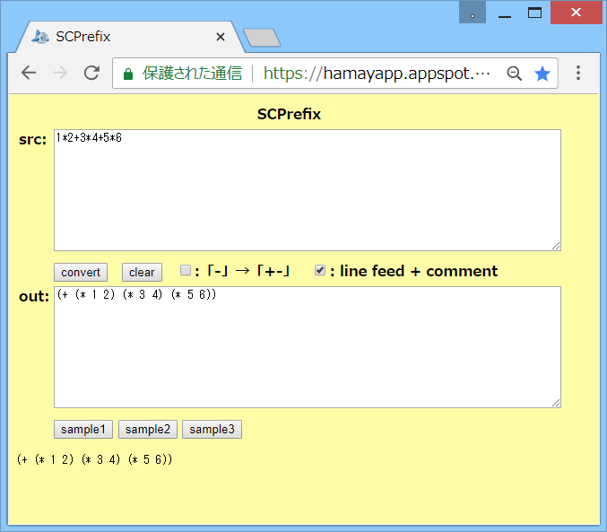

# SCPrefix



## 概要
- 中置記法の数式をSchemeの前置記法に変換を行うHTMLです。

- 実行例は、以下のページにあります。  
  https://hamayapp.appspot.com/static/scprefix.html


## 使い方
- scprefix.html を ブラウザで開くと起動します。

- srcのテキストボックスに中置記法の数式を貼り付けて、  
  convertボタンをクリックすると、Schemeの前置記法に変換します。  
  結果は、outのテキストボックスに表示されます。  
  (その下にも確認用に同じものが表示されます)

- また、「-」→「+-」のチェックボックスにチェックを入れると、  
  演算子の - を +- に変換することで、多項式の変換結果を若干見やすくします。

- また、「line feed + comment」のチェックボックスにチェックを入れると、  
  入力の改行とコメントを、変換結果に反映します。

- clearボタンをクリックすると、入出力をすべてクリアします。

- sample1-3ボタンをクリックすると、変換の例を表示します。


## 中置記法の数式の文法
- (各種記号はすべて半角です)

1. 区切り記号  
   半角スペース,タブ,改行が、区切り記号になります。  
   また、セミコロン(;)が、数式の区切り記号になります。  
   (改行のみだと、次の行に式が続く場合があります)

2. コメント  
   `/* ～ */` で囲った部分はコメントとなり、変換時に無視されます。  
   また、// を書いた行は行末までコメントとなり、変換時に無視されます。

3. 演算子  
   以下の演算子が使用可能です。  
   レベルが小さいほど優先順位が高くなります。  
   (C言語に近いが、微妙に種類や優先順位が異なるので注意)
   ```
     レベル1  : () ++ --        (括弧,INC,DEC)
     レベル2  : **              (べき乗 (右結合))
     レベル3  : ! ~ + - +. -.   (論理NOT,ビットNOT,正符号/負符号,不正確数正符号/負符号)
     レベル4  : * / *. /. \ %   (乗算,除算,不正確数乗算,不正確数除算,整数除算,整数剰余)
     レベル5  : + - +. -. %%    (加算,減算,不正確数加算,不正確数減算,文字列結合)
     レベル6  : << >>           (左ビットシフト,右ビットシフト (正確整数の符号付きシフトのみ))
     レベル7  : < <= > >= == != (数値比較 (大小比較は実数のみ)))
     レベル8  : & | ^           (ビットAND,ビットOR,ビットXOR (正確整数のみ))
     レベル9  : && || a?b:c     (論理AND,論理OR,3項演算子)
     レベル10 : , = *= /= *.= /.= += -= +.= -.= %%= \= %= <<= >>= &= |= ^=
                                (カンマ演算子,代入,複合代入)
   ```

4. 名前  
   区切り記号,演算子記号,および一部の記号( " , ' , { , } , [ , ] )を含まない文字列は、  
   名前として使用できます。  
   名前は、変数名や関数名になります。  
   ( abc  sin  等)  
   
   また、 で囲うことで、各種記号を含んだ文字列も、  
   名前として使用できます (   等)。  
    の囲みは、変換時に外されて中身だけが出力されます。  
   (  → a-b-c  等)  
    内で { , } , % の文字を表したい場合は、\\ でエスケープしてください( \\{ , \\} , \\% )。  
   また、\\ 自身を表したい場合は、\\\\ と記述してください。

5. 関数  
   名前の後に ( ) をつけると、関数を表します ( sin(0)  gcd(100,36)  等)。  
   ( ) 内には関数の引数を カンマ(,)で区切って記述します(引数のない関数もあります)。  
   関数は数式中で使用できます ( y=sin(0) 等)。

6. 変数  
   変数は数式中で使用できます。各種演算や代入が行えます ( y=x+1 等)。  
   また、変数に [ ] をつけると、配列変数になります ( a[0] 等)。  
   `[ ]` 内には配列の要素を指定する数値や式を記述します。  
   また、複数の [ ] をつけると、多次元配列になります ( a[100][200] 等)。

7. 文字列リテラル  
   文字列をダブルクォート(")またはシングルクォート(')で囲うと、  
   文字列リテラルを表します ( "abc"  'abc'  等)。  
   現状、文字列リテラルに対する演算子は、文字列結合の %% のみが使用できます。  
   ( y = "aaa" %% "bbb"  等)  
   文字列リテラル内で、ダブルクォートまたはシングルクォートの文字を表したい場合は、  
   \\ でエスケープしてください( \\" , \\' )。  
   また、\\ 自身を表したい場合は、\\\\ と記述してください。

8. 制御命令(機能なし)  
   現状、if, for, while, switch, goto 等の制御命令には未対応です。  
   また、新しい関数を定義するような命令も未対応です。


## 注意事項
1. 関数は、f(x1,x2) が (f x1 x2) のように変換されます。  
   実際にSchemeで使用する場合には、関数が定義されている必要があります。

2. 代入 ( x=1 等) は、set! に変換されます。  
   実際にSchemeで使用する場合には、変数が define 等で定義されている必要があります。

3. &&, || は、and, or に変換されます。  
   Schemeでは、and, or は短絡評価になります。  
   評価結果は、and の場合は、#f か 最後の要素の評価結果になります。  
   or の場合は、#f か 最初に真になった要素の評価結果になります。

4. INC,DEC ( x++ 等) は、inc!, dec! に変換されます。  
   inc!, dec! は、Schemeの処理系依存の命令です(Gaucheに存在します)。

5. ポストINC,DECの値を使う場合 ( y=x++ 等) は、begin0 を使った式に変換されます。  
   begin0 は、Schemeの処理系依存の命令です(Gaucheに存在します)。

6. 不正確数の加減乗除算 `( +.  -.  *.  /. )` は、  
   Schemeの処理系依存の命令です(Gaucheに存在します)。

7. 配列変数は、万能アクセサ`(~)`に変換されます`( y[0] → (~ y 0) 等)`。  
   万能アクセサ`(~)`は、Schemeの処理系依存の命令です(Gaucheに存在します)。  
   実際にSchemeで使用する場合には、配列変数に対応するベクタ等が定義されている必要があります。

8. 現状、内部処理で数値と名前を区別していないため、変換時のエラーチェックが不十分です。  
   例えば、以下が挙げられます。  
   - 数値への代入がエラーにならない (100=1000 等)
   - 数値のINC,DECがエラーにならない (100++ 等)
   - 100(200)の100が関数名とみなされて(100 200)と変換される


## 環境等
- OS
  - Windows 8.1 (64bit)
- ブラウザ
  - Chrome v67

## 履歴
- 2015-1-16  v1.00 (初版)
- 2015-1-16  v1.01 コメント修正のみ
- 2015-1-17  v1.02 複合代入の最適化処理ミス修正  
  (減算,除算は計算順の変更不可。他の演算も順序が変わるので、最適化処理を削除)  
  波括弧の機能追加
- 2015-1-18  v1.03 べき乗の修正(優先順位の見直しと右結合への変更)  
  minus conv. のチェックボックス追加
- 2015-1-18  v1.04 行番号(デバッグ用)の計算処理修正
- 2015-1-18  v1.05 一部処理見直し(continue)
- 2015-1-19  v1.06 負符号が連続したときは削除する。チェックボックス表示変更
- 2015-1-19  v1.07 カンマ区切りが連続したときの最適化処理もれ修正
- 2015-1-20  v1.08 エラー表示修正等(debugpos2)
- 2015-1-20  v1.09 演算子データの形式見直し
- 2015-1-20  v1.10 負符号の最適化処理ミス修正  
  (負符号の連続の削除は、括弧内の減算も削除してしまうため廃止)
- 2015-1-20  v1.11 コメント修正等
- 2015-1-24  v1.12 エラーメッセージ一部修正
- 2015-2-4   v1.13 配列変数対応
- 2015-2-4   v1.14 終端チェックミス修正
- 2015-5-21  v1.15 サンプルボタン追加
- 2015-6-21  v1.16 文字列リテラル対応
- 2015-6-24  v1.17 文字列結合の演算子 %% を追加
- 2015-6-25  v1.18 コメント修正のみ
- 2015-6-25  v1.19 カンマ区切りの最適化処理ミス修正
- 2015-6-26  v1.20 文字列リテラルのチェック処理追加
- 2015-10-31 v1.21 トークン分割のエスケープ処理修正
- 2015-11-4  v1.22 改行反映フラグを追加
- 2015-11-4  v1.23 一部処理見直し(match2)
- 2015-11-4  v1.24 チェックボックスの初期選択見直し
- 2015-11-6  v1.25 入力のコメントを変換結果に反映
- 2015-11-7  v1.26 名前の囲みを { } から  に変更  
  文字列の囲みのシングルクォートに対応  
  C言語の文法にある程度対応(現状、正常には変換できない)
- 2015-11-8  v1.27 最適化条件ミス修正等
- 2015-11-8  v1.28 文字列リテラル処理修正
- 2015-11-8  v1.29 トークンの種別情報追加等
- 2015-11-8  v1.30 トークン分割処理修正等
- 2015-11-9  v1.31 構文解析処理の見直しと修正等
- 2015-11-9  v1.32 コメント修正のみ
- 2015-11-9  v1.33 構文解析処理一部見直し
- 2015-11-12 v1.34 変数名一部見直し
- 2017-1-9   v1.40 1行コメントの行継続対応等
- 2017-1-12  v1.41 構文エラー表示見直し等
- 2017-1-13  v1.42 構文エラー表示見直し。キャスト判定処理見直し。トークン分割処理修正等
- 2017-4-18  v1.43 文字列の解析処理見直し等
- 2017-6-6   v1.44 関数名一部変更等
- 2017-7-17  v1.45 書式修正等
- 2018-6-26  v1.46 HTML見直し
- 2018-6-27  v1.47 HTML出力見直し(IE8対策)
- 2018-6-30  v1.48 HTML見直し


(2018-6-30)
