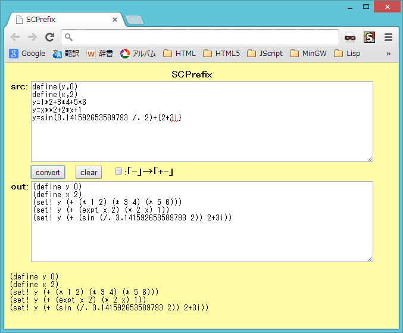

# SCPrefix



## 概要
- 中置記法の数式をSchemeの前置記法に変換を行うHTMLです。

- 実行例は、以下のページにあります。  
  https://hamayapp.appspot.com/static/scprefix.html


## 使い方
- scprefix.html を ブラウザで開くと起動します。

- srcのテキストボックスに中置記法の数式を貼り付けて、  
  convertボタンをクリックすると、Schemeの前置記法に変換します。  
  結果は、outのテキストボックスに表示されます。  
  (その下にもデバッグ用に同じものが表示されます)

- また、「-」→「+-」のチェックボックスにチェックを入れると、  
  演算子の - を +- に変換することで、多項式の変換結果を若干見やすくします。

- clearボタンをクリックすると、入出力をすべてクリアします。


## 中置記法の数式の文法
- (各種記号はすべて半角です)

1. 区切り記号  
   半角スペース,タブ,改行が、区切り記号になります。  
   また、セミコロン(;)が、数式の区切り記号になります。  
   (改行のみだと、次の行に式が続く場合があります)

2. コメント  
   /* ～ */ で囲った部分はコメントとなり、変換時に無視されます。  
   また、// を書いた行は行末までコメントとなり、変換時に無視されます。

3. 演算子  
   以下の演算子が使用可能です。  
   レベルが小さいほど優先順位が高くなります。  
   (C言語に近いが、微妙に種類や優先順位が異なるので注意)
   ```
     レベル1  : () ++ --        (括弧,INC,DEC)
     レベル2  : **              (べき乗 (右結合))
     レベル3  : ! ~ + -         (論理NOT,ビットNOT,正符号,負符号)
     レベル4  : * / *. /. \ %   (乗算,除算,不正確数乗算,不正確数除算,整数除算,整数剰余)
     レベル5  : + - +. -.       (加算,減算,不正確数加算,不正確数減算)
     レベル6  : << >>           (左ビットシフト,右ビットシフト (正確整数の符号付きシフトのみ))
     レベル7  : < <= > >= == != (数値比較 (大小比較は実数のみ)))
     レベル8  : & | ^           (ビットAND,ビットOR,ビットXOR (正確整数のみ))
     レベル9  : && || a?b:c     (論理AND,論理OR,3項演算子)
     レベル10 : , = *= /= *.= /.= += -= +.= -.= \= %= <<= >>= &= |= ^=
                                (カンマ演算子(括弧内でのみ使用可),代入,複合代入)
   ```

4. 名前  
   区切り記号と演算子を含まない文字列は、名前として使用できます。  
   名前は、変数名や関数名になります。  
   現状、数値などもすべて名前として扱われます。  
   
   また、波括弧 { } で囲うことで、波括弧内の文字列を名前として使用できます。  
   これによって区切り記号や演算子の記号を含んだ名前を使用できます。  
   ( {"a b c"}  {1+2i}  等  (ただし 演算子と全く同じ名前は使用不可))  
   波括弧内で 波括弧の文字を名前に使いたい場合は、\\ でエスケープします。  
   また、\\ 自身を名前に使う場合は、\\\\ と記述します。  
   波括弧の囲みは、変換時に外されて中身だけが出力されます。

5. 関数  
   名前の後に ( ) をつけると、関数を表します ( sin(0)  gcd(100,36)  等)。  
   ( ) 内には関数の引数を カンマ(,)で区切って記述します(引数のない関数もあります)。  
   関数は数式中で使用できますが、代入の左辺に置くことはできません。

6. 変数  
   変数は数式中で使用できます。代入の左辺にも置くことができます。


## 注意事項
1. 関数は、f(x1,x2) が (f x1 x2) のように変換されます。  
   実際にSchemeで使用する場合には、関数が定義されている必要があります。

2. 代入 ( x=1 等) は、set! に変換されます。  
   実際にSchemeで使用する場合には、変数が define 等で定義されている必要があります。

3. &&, || は、and, or に変換されます。  
   Schemeでは、and, or は短絡評価になります。  
   評価結果は、and の場合は、#f か 最後の要素の評価結果になります。  
   or の場合は、#f か 最初に真になった要素の評価結果になります。

4. INC,DEC ( x++ 等) は、inc!, dec! に変換されます。  
   inc!, dec! は、Schemeの処理系依存の命令です(Gaucheに存在します)。

5. ポストINC,DECの値を使う場合 ( y=x++ 等) は、begin0 を使った式に変換されます。  
   begin0 は、Schemeの処理系依存の命令です(Gaucheに存在します)。

6. 不正確数の加減乗除算( +.  -.  *.  /. ) は、  
   Schemeの処理系依存の命令です(Gaucheに存在します)。

7. 現状、数値と名前を区別していないため、変換時のエラーチェックが不十分です。  
   例えば、以下が挙げられます。  
   - 数値への代入がエラーにならない (100=1000 等)
   - 数値のINC,DECがエラーにならない (100++ 等)
   - 100(200)の100が関数名とみなされて(100 200)と変換される


## 環境等
- 以下の環境で動作を確認しました。
  - OS
    - Windows 8 (64bit)
  - ブラウザ
    - Chrome v39

## 履歴
- 2015-1-16 v1.00 (初版)
- 2015-1-16 v1.01 コメント修正のみ
- 2015-1-17 v1.02 複合代入の最適化処理ミス修正  
  (減算,除算は計算順の変更不可。他の演算も順序が変わるので、最適化処理を削除)  
  波括弧リテラルの追加
- 2015-1-18 v1.03 べき乗の修正(優先順位の見直しと右結合への変更)  
  minus conv. のチェックボックス追加
- 2015-1-18 v1.04 行番号(デバッグ用)の計算処理修正
- 2015-1-18 v1.05 一部処理見直し
- 2015-1-19 v1.06 負符号が連続したときは削除する。チェックボックス表示変更
- 2015-1-19 v1.07 カンマ区切りが連続したときの最適化処理もれ修正
- 2015-1-20 v1.08 エラー表示修正等
- 2015-1-20 v1.09 演算子データの形式見直し
- 2015-1-20 v1.10 負符号の最適化処理ミス修正  
  (負符号の連続の削除は、括弧内の減算も削除してしまうため廃止)
- 2015-1-20 v1.11 コメント修正等


(2015-1-20)
